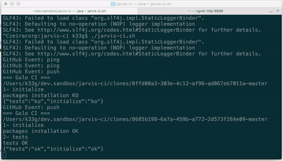

# jarvis-ci
CI server written in **[Golo](http://golo-lang.org/)**

## Installation

- `git clone` this repository
- run: `golo golo --classpath jars/*.jar --files main.golo` or `./jarvis-ci.sh`

### If you run Jarvis-CI at :home:

- download [ngrok](https://ngrok.com/)
- `./ngrok http 8888`
- copy the ngrok url | eg: http://23c3dc84.ngrok.io/

### Else

- get the url of your server
- currently **Jarvis-CI** is listening on `8888`

## WebHook

- create/fork a repository like this: https://github.com/k33g/fantastic-train
- create a webhook in the repository on which you want to apply CI
  - go to `Settings/Webhooks & services`
  - click on `Add webhook`
    - add the payload URL: your server url + `golo_ci` | eg: http://23c3dc84.ngrok.io/golo_ci
    - set content-type to `application/json`
    - set events to "Send me everything"
    - click on `Add webhook`

## Define a golo pipeline

- add a `ci.golo` file with this content
  ```golo
	## ci.golo ...
	function do = |context| {
	  println("=== Golo CI ===")
	  let path = currentDir() + "/" + context: tmp_dir()
	  println(path)
	  # Stage: initialize
	  println("1- initialize")
	  if context: sh("./npm_install.sh {0}", path): equals(0) {
	    println("packages installation OK")
	    # Stage: tests
	    println("2- tests")
	    if context: sh("./npm_run.sh {0} {1}", path, "test"):  equals(0) {
	      println("tests OK")
	      return DynamicObject(): initialize("ok"): tests("ok")
	    } else {
	      println("tests KO")
	      return DynamicObject(): initialize("ok"): tests("ko")
	    }
	  } else {
	    println("packages installation KO")
	    return DynamicObject(): initialize("ko"): tests("ko")
	  }

	}
  ```

Now, each time you commit on a branch, the remote repository is cloned, and the branch is checked out, then, the `ci.golo` file of the current branch is executed.




Currently, **Jarvis-CI** works only with simple Node.js projects (It's a POC)

## TODO

- configuration file (http port, etc...)
- :octocat: status for PR
- Web UI
- ...
