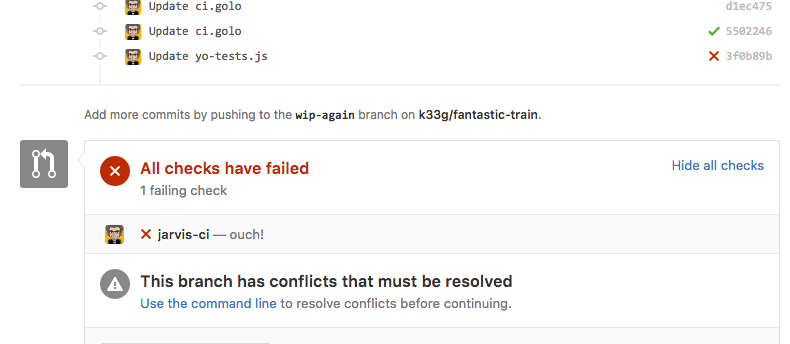

# Jarvis-ci
CI server written in **[Golo](http://golo-lang.org/)**

> This is a POC

## Installation

- `git clone` this repository
- run: `golo golo --classpath jars/*.jar --files config.golo main.golo` or `./jarvis-ci.sh`

### If you run Jarvis-CI at :home:

- download [ngrok](https://ngrok.com/)
- `./ngrok http 8888`
- copy the ngrok url | eg: http://23c3dc84.ngrok.io/

### Else

- get the url of your server
- currently **Jarvis-CI** is listening on `8888`

## WebHook

- create/fork a repository like this: https://github.com/k33g/fantastic-train
- create a webhook in the repository on which you want to apply CI
  - go to `Settings/Webhooks & services`
  - click on `Add webhook`
    - add the payload URL: your server url + `golo_ci` | eg: http://23c3dc84.ngrok.io/golo_ci
    - set content-type to `application/json`
    - set events to "Send me everything"
    - click on `Add webhook`

## Personal access tokens

- go to your :octocat: settings
- click on "Personal access tokens"
- generate a token and copy it to the `config.golo`

```golo
module config

function config = {
  return DynamicObject()
    : token("your_token_here")
    : http_port(8888)
    : host("api.github.com")
}
```

If you use :octocat: Enterprise, your `config.golo` file will be like that:

```golo
function config = {
  return DynamicObject()
    : token("56fc42a6646aebe8af59e2bc980e8744bec5579d")
    : http_port(8888)
    : enterprise(true)
    : host("ghe.k33g")
    : scheme("http")
    : port(-1)
}
```

## Define a golo pipeline

- add a `ci.golo` file with this content
```golo
## ci.golo 
function check = |context| {
  context: info("{0}", "=== Jarvis-CI ===")
  context: info("Repository {0}", context: repo(): name())
  context: info("Current branch {0}", context: repo(): branchName())
  let path = currentDir() + "/" + context: tmp_dir()
  context: info("path: {0}", path)
  # Stage: initialize
  context: info("{0}", "1- initialize")
  if context: sh("./npm_install.sh {0}", path): equals(0) {
    context: success("{0}", "packages installation OK")
    # Stage: tests
    context: info("{0}", "2- tests")
    if context: sh("./npm_run.sh {0} {1}", path, "test"):  equals(0) {
      context: success("{0}", "tests OK")
      return DynamicObject(): initialize("ok"): tests("ok"): status("success"): description("you are the best!"): context("jarvis-ci")
    } else {
      context: warning("{0}", "tests KO")
      return DynamicObject(): initialize("ok"): tests("ko"): status("failure"): description("ouch!"): context("jarvis-ci")
    }
  } else {
    context: fail("{0}", "packages installation KO")
    return DynamicObject(): initialize("ko"): tests("ko"): status("failure"): description("ouch!"): context("jarvis-ci")
  }

}
```

Now, each time you commit on a branch, the remote repository is cloned, and the branch is checked out, then, the `ci.golo` file of the current branch is executed.

**Remark**: If you don't precise **status**, It won't be checking on the PR





Currently, **Jarvis-CI** works only with simple Node.js projects (It's a POC)

## Build something else then Node.js project

**Jarvis-CI** is only a messenger, so you only have to create necessary `.sh` files and write your own `ci.golo` integration script.


## TODO

- Web UI
- ...


